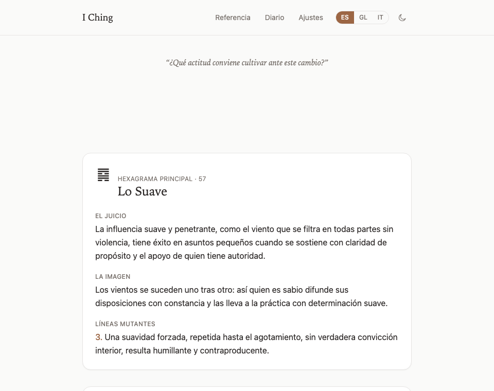

# I Ching — App de consultas

Aplicación minimalista y contemplativa para consultas al I Ching mediante el método tradicional
de las 3 monedas, con diario personal. 100% local, sin cuentas ni backend. Ver
[`spec-iching-app.md`](./spec-iching-app.md) para la especificación completa del proyecto.

Estado actual: la app web está funcionalmente completa y auditada — motor de consulta, las 4
pantallas principales (Nueva consulta, Resultado, Diario, Referencia de los 64 hexagramas),
Ajustes (exportar/importar el diario), favoritos, soporte PWA (instalable, funciona sin conexión)
y una auditoría de accesibilidad (ver [más abajo](#accesibilidad)).

**Decisión de alcance vigente**: por ahora el proyecto se centra únicamente en la app web. La app
móvil (React Native, reutilizando `@iching/core` sin cambios) y las mejoras opcionales de la fase
4 del roadmap del spec (método de los tallos de milenrama, temas visuales alternativos,
notificación diaria de reflexión) quedan deliberadamente en pausa como posibles mejoras futuras,
hasta que se decida retomarlas explícitamente.

## Probar la app en local



Requiere [Node.js](https://nodejs.org) ≥20. Desde la raíz del repositorio:

```bash
# 1. Instalar dependencias (todo el monorepo)
corepack pnpm install

# 2. Levantar el servidor de desarrollo de la app web
corepack pnpm --filter @iching/web dev
```

Abre en el navegador la URL que imprime el comando (normalmente `http://localhost:5173/`). Ya
puedes usar el flujo completo: Nueva consulta → Resultado → Diario → Referencia → Ajustes, y
cambiar idioma (ES/GL/IT) y tema (claro/oscuro) desde la cabecera.

> `corepack pnpm` garantiza tener pnpm disponible sin instalarlo aparte; si ya tienes `pnpm` en el
> PATH, puedes usarlo directamente en lugar de `corepack pnpm`.

Para detener el servidor: `Ctrl+C` en la terminal.

### Probar la instalación como PWA y el modo sin conexión

El service worker solo se activa en la build de producción, no en el servidor de desarrollo:

```bash
corepack pnpm --filter @iching/web build
corepack pnpm --filter @iching/web preview
```

Abre la URL que imprime (normalmente `http://localhost:4173/`). Ahí el navegador ofrece instalar
la app (icono en la barra de direcciones o "Instalar app…" en el menú), y en DevTools → pestaña
Network → "Offline" puedes comprobar que sigue funcionando sin conexión.

## Estructura del monorepo

```
packages/
  core/                 # @iching/core — motor de generación y modelo de datos, sin dependencias de UI/navegador
  storage-indexeddb/    # @iching/storage-indexeddb — adapter de persistencia (Dexie/IndexedDB)
apps/
  web/                  # @iching/web — app React + Vite
```

## Contenido de los 64 hexagramas

Ninguno de los dos PDF de referencia usados durante la planificación puede emplearse como fuente
de los textos interpretativos: ambos son material derivado de la traducción de Richard Wilhelm,
protegida por copyright (por eso no se versionan en este repo — ver `.gitignore`). El contenido
definitivo (juicio, imagen y las 6 líneas de cada hexagrama, en español, gallego e italiano) está
redactado en tono propio, a partir del sentido tradicional de cada hexagrama y usando como
referencia de fondo la traducción de **James Legge (1899, dominio público)**. Los 64 hexagramas
tienen tanto sus datos estructurales (número, trigramas, símbolo Unicode) como su contenido
interpretativo completos — ver `packages/core/src/data/hexagrams.ts` y
`packages/core/src/data/hexagrams-content.ts`.

## Desarrollo

Requiere Node ≥20 y pnpm (usar `corepack pnpm ...` si `pnpm` no está en el PATH del sistema).

```bash
pnpm install

# Tests
pnpm --filter @iching/core test
pnpm --filter @iching/storage-indexeddb test

# Servidor de desarrollo
pnpm --filter @iching/web dev

# Build de producción
pnpm --filter @iching/web build

# Todo el monorepo
pnpm -r test
pnpm -r build
```

## Idiomas y tema

La interfaz está disponible en español, gallego e italiano (selector en la cabecera), y admite
modo claro/oscuro (también en la cabecera, respeta `prefers-color-scheme` en el primer uso). El
contenido interpretativo de los 64 hexagramas sigue el mismo idioma seleccionado.

## Accesibilidad

Auditoría realizada sobre las 6 pantallas principales, en modo claro y oscuro, combinando
[axe-core](https://github.com/dequelabs/axe-core) (vía Playwright) con comprobaciones manuales de
navegación por teclado y de reflujo de texto:

- **Contraste y estructura DOM**: 0 violaciones de axe-core (incluida la regla de contraste de
  color) en las 6 pantallas × 2 temas.
- **Navegación por teclado**: todos los elementos interactivos son alcanzables con Tab en un
  orden lógico, con el foco siempre visible (anillo del color de acento), y activables con Enter.
- **`<html lang>` dinámico**: se corrigió para que siga el idioma elegido — antes quedaba fijado
  en español aunque la interfaz cambiara a gallego o italiano, lo que llevaba a un lector de
  pantalla a aplicar las reglas de pronunciación equivocadas.
- **Encabezados de página**: Resultado y el detalle de Referencia carecían de un `<h1>` (axe-core
  lo señaló como `page-has-heading-one`); se añadió uno, oculto visualmente donde el diseño no
  pedía un título visible.
- **Reflujo de texto**: la cabecera y los filtros del Diario no se ajustaban bien con el tamaño de
  letra del navegador aumentado, provocando scroll horizontal; se corrigieron con `flex-wrap` y un
  ancho máximo en el selector de hexagrama. Verificado simulando un tamaño de letra al 160%.
- **Tamaño de fuente ajustable**: no hay un control de tamaño de fuente dentro de la app — toda la
  tipografía usa unidades relativas (`rem`), por lo que ya responde correctamente al ajuste de
  tamaño de letra del navegador o del sistema operativo (verificado arriba).

## PWA (instalable, sin conexión)

La app web es una Progressive Web App: incluye manifest e icono propio (instalable desde el
navegador, tanto en escritorio como en móvil) y un service worker que precachea el bundle
completo, así que funciona sin conexión tras la primera visita. No hay llamadas de red en ningún
punto de la app (todo el diario vive en IndexedDB local), por lo que no hace falta ninguna
estrategia de caché en tiempo de ejecución más allá de ese precache — ver `apps/web/vite.config.ts`
(`vite-plugin-pwa`).
